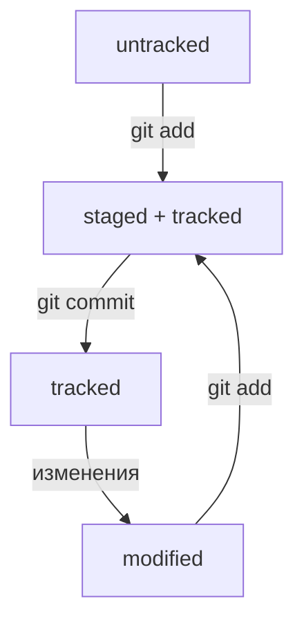

# Введение в систему контроля версий Git

Git — это распределенная система управления версиями, которая позволяет отслеживать изменения в файлах и координировать работу нескольких людей над одним проектом. Она широко используется разработчиками программного обеспечения для управления исходным кодом проектов.

## Основные команды Git

### 1. `git init`

Команда `git init` используется для создания нового репозитория Git. Она создает новую поддиректорию с именем .git внутри вашего текущего рабочего каталога, содержащую все необходимые файлы репозитория — основу Git.

### 2. `git clone`

Команда `git clone` используется для создания копии репозитория. Она создает локальную копию удаленного репозитория Git.

### 3. `git add`

Команда `git add` используется для добавления файлов в индекс. Она начинает отслеживать новые файлы и изменения в существующих файлах.

### 4. `git commit`

Команда `git commit` используется для фиксации изменений, добавленных с помощью `git add`. Каждый коммит создает новую версию проекта.

### 5. `git push`

Команда `git push` используется для отправки изменений на удаленный репозиторий. Это позволяет обновить удаленную ветку с локальными изменениями.

### 6. `git pull`

Команда `git pull` используется для получения и слияния изменений из удаленного репозитория в текущую ветку. Она позволяет вам обновить локальный репозиторий до последней версии.

### 7. `git branch`

Команда `git branch` используется для создания, удаления и просмотра веток в репозитории. Ветки помогают вам разрабатывать функции независимо друг от друга.

### 8. `git merge`

Команда `git merge` используется для слияния изменений из одной ветки в другую. Она позволяет объединить отдельные ветки истории коммитов.

### 9. `git checkout`

Команда `git checkout` используется для переключения между ветками или восстановления файлов из индекса. Она помогает управлять вашим рабочим пространством.

### 10. `git log`

Команда `git log` используется для просмотра истории коммитов в вашем репозитории. Она показывает информацию о каждом коммите, такую как автор, дата и сообщение.

## Заключение

Git предоставляет мощные инструменты для управления версиями и сотрудничества в проектах. 

>Понимание основных команд Git поможет вам эффективно работать с системой контроля версий и сократит время разработки ; )

- [Информация взята отсюда](https://github.com/)

### Часть 2

## Хеш — идентификатор коммита

Git хеширует (преобразует) информацию о коммите с помощью алгоритма SHA-1 (от англ. Secure Hash Algorithm — «безопасный алгоритм хеширования») и получает для каждого коммита свой уникальный хеш — результат хеширования.

## Файл HEAD 
(англ. «голова», «головной») — один из служебных файлов папки .git. Он указывает на коммит, который сделан последним (то есть на самый новый).

## Жизненный цикл файлах

