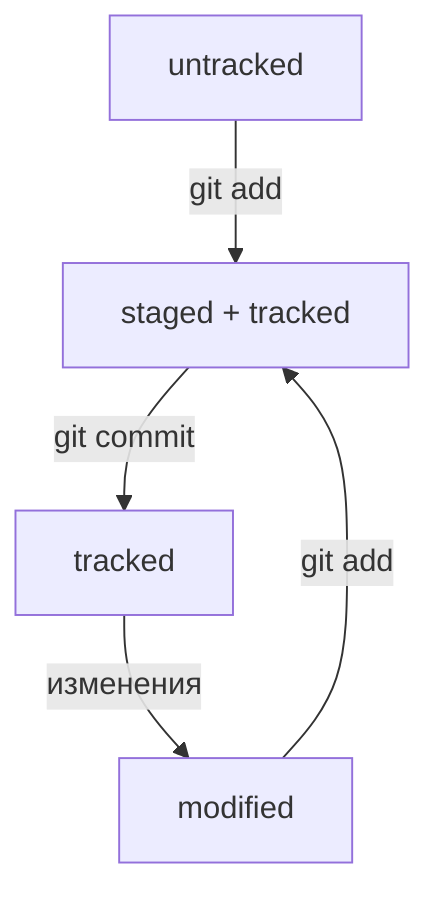

# Введение в систему контроля версий Git

Git — это распределенная система управления версиями, которая позволяет отслеживать изменения в файлах и координировать работу нескольких людей над одним проектом. Она широко используется разработчиками программного обеспечения для управления исходным кодом проектов.

## Основные команды Git

### 1. `git init`

Команда `git init` используется для создания нового репозитория Git. Она создает новую поддиректорию с именем .git внутри вашего текущего рабочего каталога, содержащую все необходимые файлы репозитория — основу Git.

### 2. `git clone`

Команда `git clone` используется для создания копии репозитория. Она создает локальную копию удаленного репозитория Git.

### 3. `git add`

Команда `git add` используется для добавления файлов в индекс. Она начинает отслеживать новые файлы и изменения в существующих файлах.

### 4. `git commit`

Команда `git commit` используется для фиксации изменений, добавленных с помощью `git add`. Каждый коммит создает новую версию проекта.

### 5. `git push`

Команда `git push` используется для отправки изменений на удаленный репозиторий. Это позволяет обновить удаленную ветку с локальными изменениями.

### 6. `git pull`

Команда `git pull` используется для получения и слияния изменений из удаленного репозитория в текущую ветку. Она позволяет вам обновить локальный репозиторий до последней версии.

### 7. `git branch`

Команда `git branch` используется для создания, удаления и просмотра веток в репозитории. Ветки помогают вам разрабатывать функции независимо друг от друга.

### 8. `git merge`

Команда `git merge` используется для слияния изменений из одной ветки в другую. Она позволяет объединить отдельные ветки истории коммитов.

### 9. `git checkout`

Команда `git checkout` используется для переключения между ветками или восстановления файлов из индекса. Она помогает управлять вашим рабочим пространством.

### 10. `git log`

Команда `git log` используется для просмотра истории коммитов в вашем репозитории. Она показывает информацию о каждом коммите, такую как автор, дата и сообщение.

## Заключение

Git предоставляет мощные инструменты для управления версиями и сотрудничества в проектах. 

>Понимание основных команд Git поможет вам эффективно работать с системой контроля версий и сократит время разработки ; )

- [Информация взята отсюда](https://github.com/)

### Часть 2

## Хеш — идентификатор коммита

Git хеширует (преобразует) информацию о коммите с помощью алгоритма SHA-1 (от англ. Secure Hash Algorithm — «безопасный алгоритм хеширования») и получает для каждого коммита свой уникальный хеш — результат хеширования.

## Файл HEAD 
(англ. «голова», «головной») — один из служебных файлов папки .git. Он указывает на коммит, который сделан последним (то есть на самый новый).

## Жизненный цикл файлах



## Клонирование чужого репозитория
```
git clone git@github.com:NonEstArsMea/first-project.git
```
(от англ. clone, «клон», «копия») — склонируй репозиторий с URL `first-project.git` из аккаунта `NonEstArsMea` на мой локальный компьютер.
## Создание веток
```
git branch feature/the-finest-branch
```
(от англ. branch, «ветка») — создай ветку от текущей с названием `feature/the-finest-branch`;
```
git checkout -b feature/the-finest-branch
```
 — создай ветку `feature/the-finest-branch` и сразу переключись на неё.
## Навигация по веткам
```
git branch (от англ. branch, «ветка»)
```
 — покажи, какие есть ветки в репозитории и в какой из них я нахожусь (текущая ветка будет отмечена символом `*`);
```
git branch -a
```
 — покажи все известные ветки, как локальные (в локальном репозитории), так и удалённые (в `origin`, или на `GitHub`).
```
git checkout feature/br
```
 — переключись на ветку feature/br.
## Сравнение веток
```
git diff main HEAD
```
(от англ. difference, «отличие», «разница») — покажи разницу между веткой `main` и указателем на `HEAD`;
```
git diff HEAD~2 HEAD
```
 — покажи разницу между тем коммитом, который был два коммита назад, и текущим.
## Удаление веток
```
git branch -d br-name
```
 — удали ветку `br-name`, но только если она является частью `main`;
```
git branch -D br-name
```
 — удали ветку br-name, даже если она не объединена с `main`.
## Слияние веток
```
git merge main
```
 (от англ. merge, «сливать», «поглощать») — объедини ветку `main` с текущей активной веткой. 
## Работа с удалённым репозиторием
```
git push -u origin my-branch
```
(от англ. push, «толкнуть», «протолкнуть») — отправь новую ветку `my-branch` в удалённый репозиторий и свяжи локальную ветку с удалённой, чтобы при дополнительных коммитах можно было писать просто `git push` без `-u`;
```
git push my-branch
```
 — отправь дополнительные изменения в ветку `my-branch`, которая уже существует в удалённом репозитории;
```
git pull
```
 (от англ. pull, «вытянуть») — подтяни изменения текущей ветки из удалённого репозитория.

Самый популярный подход к работе с `Git` в команде — это `feature branch workflow`. 
В нём создают ветку для каждой задачи (например, для новой функциональности или исправления бага), а когда всё готово, вливают новую ветку в `main`.
Важные этапы этого процесса — пул-реквест и ревью изменений. Пул-реквест — это интерфейс, в котором можно обсудить изменения. 
Ревью — просмотр изменений другими участниками и один из способов проверить качество таких изменений.
Если вы уже участник проекта (или `collaborator` в терминах `GitHub`), можно клонировать репозиторий напрямую. А если нет, нужно предварительно сделать «форк». 
Также для участников доступна кнопка Merge после ревью, а для неучастников — нет.

Алгоритм-шпаргалка для создания PR
1 - Склонировать репозиторий.
	1.1 - Если вы не участник проекта, предварительно сделать «форк» исходного репозитория.
	1.2 - На странице репозитория или «форка» нажать кнопки: `Code → SSH → скопировать ссылку`.
	1.3 - Выполнить команду `git clone` <ссылка на репозиторий>.
2 - Создать ветку для вашей задачи: `git checkout -b my-task-branch-name`.
3 - Добавить и «закоммитить» изменения, которые вы хотите внести в проект.
4 - «Запушить» ветку: `git push --set-upstream origin HEAD` или `git push -u origin my-task-branch-name`.
	4.1 - `GitHub` (с помощью `Git`) выведет ссылку на создание `PR`. По ней нужно перейти.
	4.2 -` PR` можно также создать через интерфейс `GitHub`.
5 - Сообщить о пул-реквесте ревьюеру.
	5.1 - Иногда ревьюеры назначаются автоматически, тогда сообщать не нужно.
6 - Обсуждать с ревьюером предлагаемые изменения и вносить правки, пока эти изменения не будут одобрены (пока не будет получен «апрув»).  
	6.1. Если кто-то добавил конфликтующие изменения в main, пока ваш PR был на ревью, нужно разрешить конфликт:  
		Обновить main: `git checkout main && git pull`.
		Влить main в свою ветку: `git checkout my-task-branch-name && git merge main`.
		Разрешить конфликты слияния с помощью IDE или вручную.
		Создать коммит слияния: `git commit --no-edit или git commit -m 'merge main'`.
		Сделать `git` push своей ветки.
7 - Нажать кнопку Merge или подождать, пока её нажмёт кто-то ещё.
8 - Ещё раз обновить `main`, чтобы «подтянуть» ваши изменения в основную ветку локального репозитория: `git checkout main && git pull`.
9 - Вы великолепны! Можете начинать снова со второго пункта.


